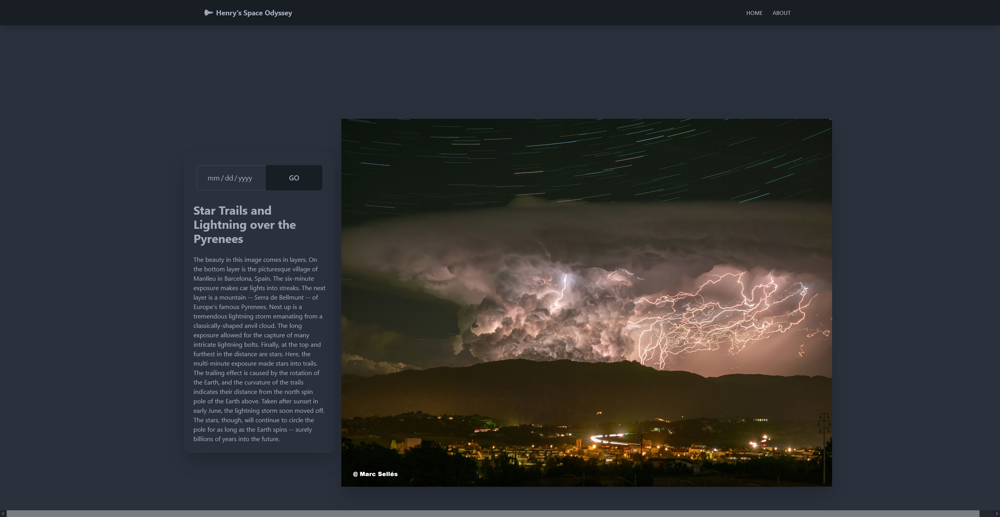
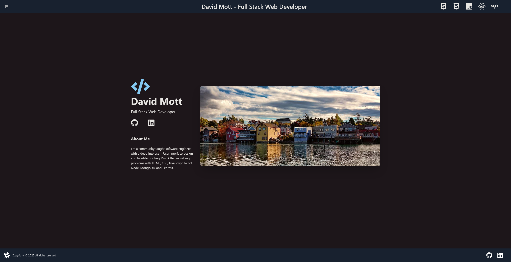

  

<h1 align="center">
  Hi
  
  , I'm Dave
</h1>

  

  
  
  

  

---

<h1 align="center">:man_technologist: About Me</h1>

- I am a Full Stack Developer  from Washington State.

- 🔭 I’m currently working on [Henry's Space Odyssey](https://vercel.com/hi-imdave/hso-react)

- 🌱 I’m currently learning **Node, and React**

- 👨‍💻 All of my projects are available on my  and I can be reached at 

---

<h1 align="center">Languages and Tools</h1>

  
  
  
  
  
  
  
  
  
  
  
  
  
  
  
  
  
  
  

---

<h1 align="center">:fire: My Stats</h1>

<h1 align="center">Projects</h1>
<table bordercolor="#66b2b2">
  
  <tr>
    <td width="50%" valign="top">
      <h3 align="center">Henry's Space Odyssey</h3>
         
        
         
        

          
    
  
      

        
<strong>HTML, CSS, & Javascript</strong> - Platform for children to learn about space in an interactive way!

    </td>
    <td width="50%" valign="top">
      <h3 align="center">My Portfolio</h3>
         
      
         
        

          
  
  
      

        
<strong>HTML, TailwindCSS, Javascript & React</strong> - Portfolio Site including links to my projects and ways to get in contact with me.

    </td>
  </tr>
  
  <!-- <tr>
    <td width="50%" valign="top">
      <h3 align="center">####</h3>
       
        
       
        

  
  
      

        
<strong>HTML5, CSS3, & Javascript</strong> - ################.

    </td>
    <td width="50%" valign="top">
      <h3 align="center">####</h3>
         
        
         
        

  
  
      

        
<strong>HTML5, CSS3, & Javascript</strong> - ########

    </td>
  </tr> -->
</table>

<!-- <h1 align="center">Technologies</h1> -->

<!-- 

    
    
    
    
    
    
    
    
    
    
    
    
    
    
    
    
    
    
    
    

 -->

---

<h1 align="center">Connect</h1>

  
  
  

